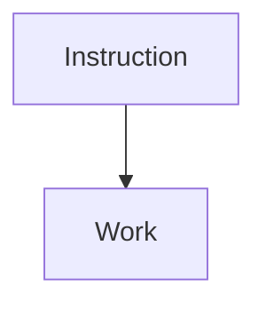

# EEnormous
### An in-development just-in-time (JIT) compiler for the Playstation 2 Emotion Engine

#### (Currently considered unstable!)
---
## Features
- [x] Assertions (Unit-Testing)
- [x] Pseudo instructions
---

The larger goal is to create a suite of tests that can verify instruction level accuracy for dynamic recompilers, or interpreters emulating the PS2 EE.

**Q:** Why is it called EEnormous?

**A:** There is an enormous amount of instructions to implement and test, which is an enormous amount of work. Just see:

